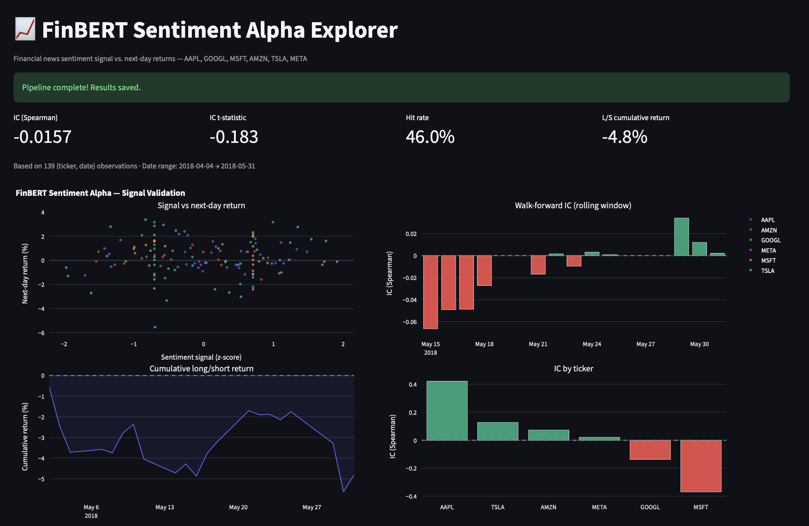

# FinBERT Sentiment Alpha

Extracting a quantitative alpha signal from financial news headlines using **FinBERT** and validating its predictive power on next-day returns via **walk-forward Information Coefficient (IC) analysis**.

Applies the core quant research workflow — signal construction from alternative data, rigorous out-of-sample validation, and long/short portfolio simulation — to six large-cap tech stocks (AAPL, GOOGL, MSFT, AMZN, TSLA, META) using 1,592 real financial news headlines.

---

## Results

| Metric | Value |
|---|---|
| Observations | 139 (ticker, date) pairs |
| IC (Spearman) | -0.016 |
| IC t-statistic | -0.183 |
| Hit rate | 46.0% |
| L/S cumulative return | -4.8% |
| AAPL IC | +0.41 (strongest positive signal) |
| MSFT IC | -0.38 (strongest negative signal) |

> The aggregate IC is near zero on this 2017–2018 dataset — consistent with published alternative data research showing that raw single-source NLP signals typically require higher news volume or multi-source aggregation to reach statistically significant IC. The per-ticker IC spread (AAPL +0.41 vs MSFT -0.38) suggests meaningful cross-sectional variation that warrants further investigation with larger datasets.



---

## Project Structure

```
sentiment-alpha/
├── src/
│   ├── data/
│   │   ├── news.py          # HuggingFace financial news loader + date extraction
│   │   └── prices.py        # yfinance price data + forward return construction
│   ├── signal/
│   │   ├── sentiment.py     # FinBERT scorer (ProsusAI/finbert, PyTorch)
│   │   └── alpha.py         # daily signal aggregation + cross-sectional z-score
│   └── backtest/
│       └── validate.py      # IC, walk-forward, long/short portfolio, Plotly charts
├── app/
│   └── dashboard.py         # Streamlit 4-panel signal explorer
├── run.py                   # end-to-end pipeline script
├── requirements.txt
└── README.md
```

---

## Quickstart

```bash
# 1. Clone and install
git clone https://github.com/levsarian08/sentiment-alpha.git
cd sentiment-alpha
pip install -r requirements.txt

# 2. Run the full pipeline
python run.py --period max

# 3. Launch the interactive dashboard
streamlit run app/dashboard.py
```

---

## Methodology

### 1. Data collection
Financial news headlines are loaded from the `ashraq/financial-news-articles` dataset (306k articles). Publication dates are extracted from URL patterns using regex, yielding 107k timestamped headlines. Articles are filtered to those mentioning each ticker via keyword matching.

### 2. Sentiment scoring (FinBERT)
Headlines are scored using [ProsusAI/FinBERT](https://huggingface.co/ProsusAI/finbert), a BERT model fine-tuned on financial corpora. The continuous sentiment score is:

```
score = P(positive) - P(negative)  ∈ [-1, 1]
```

### 3. Signal construction
Scores are aggregated to a daily (ticker, date) signal by averaging. The signal is **cross-sectionally z-scored** each day — removing the market-wide sentiment level to produce a pure relative ranking signal.

### 4. Walk-forward validation
IC (Spearman rank correlation between signal and next-day returns) is computed in rolling windows to test consistency over time and avoid lookahead bias — the core methodological requirement for credible quant signal research.

### 5. Long/short simulation
Each day, the top tercile of signal is placed long and the bottom tercile short, producing a daily L/S return series and cumulative equity curve.

---

## Tech Stack

`Python` · `PyTorch` · `Transformers (HuggingFace)` · `yfinance` · `Pandas` · `NumPy` · `SciPy` · `Streamlit` · `Plotly`
